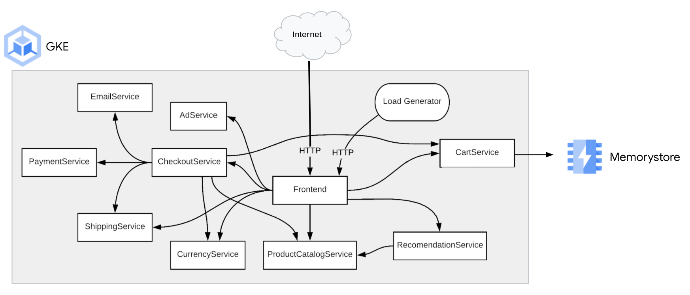

# Memorystore (redis) + OnlineBoutique

This guide contains instructions for overriding the default in-cluster `redis` database for `cartservice` with Memorystore (redis).

Important notes:
- You can connect to a Memorystore (redis) instance from GKE clusters that are in the same region and use the same network as your instance.
- You cannot connect to a Memorystore (redis) instance from a GKE cluster without VPC-native/IP aliasing enabled.



## Steps
 
1. Create a GKE cluster with VPC-native/IP aliasing enabled.

```sh
PROJECT_ID="personal-project-jg"
ZONE="us-west1-b"
REGION="OREGON"

gcloud container clusters create onlineboutique \
    --project=${PROJECT_ID} \
    --zone=${ZONE} \
    --machine-type=e2-standard-2 \
    --enable-ip-alias
```

2. Enable the Memorystore (redis) service on your project.

```sh
gcloud services enable redis.googleapis.com --project=${PROJECT_ID}
```

3. Create the Memorystore (redis) instance. 

```sh
gcloud redis instances create redis-cart --size=1 --region=${REGION} --zone=${ZONE} --redis-version=redis_6_x --project=${PROJECT_ID}
```

After a few minutes, you will see the `STATUS` as `READY` when your Memorystore instance will be successfully provisioned:

```sh
gcloud redis instances list --region ${REGION}
```

4. Update current manifests to target this Memorystore (redis) instance.

```sh
cp ./release/kubernetes-manifests.yaml ./release/updated-manifests.yaml
REDIS_IP=$(gcloud redis instances describe redis-cart --region=${REGION} --format='get(host)')
sed -i "s/value: \"redis-cart:6379\"/value: \"${REDIS_IP}\"/g" ./release/updated-manifests.yaml
```

In addition, in the `./release/updated-manifests.yaml` file you need also to manually remove the `Deployment` and `Service` sections of the `redis-cart` which are not needed anymore.

5. Apply all the updated manifests. 

```sh
kubectl apply -f ./release/updated-manifests.yaml
```

6. **Wait for the Pods to be ready.**

```
kubectl get pods
```

After a few minutes, you should see:

```
NAME                                     READY   STATUS    RESTARTS   AGE
adservice-76bdd69666-ckc5j               1/1     Running   0          2m58s
cartservice-66d497c6b7-dp5jr             1/1     Running   0          2m59s
checkoutservice-666c784bd6-4jd22         1/1     Running   0          3m1s
currencyservice-5d5d496984-4jmd7         1/1     Running   0          2m59s
emailservice-667457d9d6-75jcq            1/1     Running   0          3m2s
frontend-6b8d69b9fb-wjqdg                1/1     Running   0          3m1s
loadgenerator-665b5cd444-gwqdq           1/1     Running   0          3m
paymentservice-68596d6dd6-bf6bv          1/1     Running   0          3m
productcatalogservice-557d474574-888kr   1/1     Running   0          3m
recommendationservice-69c56b74d4-7z8r5   1/1     Running   0          3m1s
shippingservice-6ccc89f8fd-v686r         1/1     Running   0          2m58s
```

7. **Access the web frontend in a browser** using the frontend's `EXTERNAL_IP`.

```
kubectl get service frontend-external | awk '{print $4}'
```

**Note**- you may see `<pending>` while GCP provisions the load balancer. If this happens, wait a few minutes and re-run the command.

## Resources

- [Connecting to a Redis instance from a Google Kubernetes Engine cluster](https://cloud.google.com/memorystore/docs/redis/connect-redis-instance-gke)
